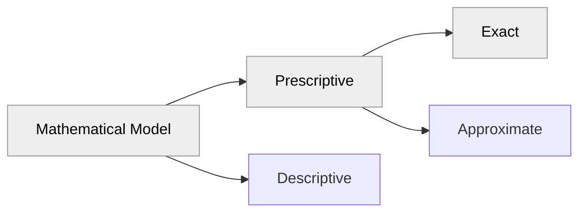

# Course Timetabling

## Phase 1: Allocate professors to courses

This project is a course timetabling system that uses a mathematical model to optimize the allocation of professors to courses. The optimization method is based on linear programming using the Gurobi solver. The case study is applied to the Institute of Computing at UFRJ, as part of my undergraduate thesis.

> The latest result of the model, pointing to the main branch, can be viewed at the following URL: [https://course-timetabling-ufrj.streamlit.app](https://course-timetabling-ufrj.streamlit.app)

### Phase 2: Allocate classrooms to courses
This project is part 1 of 2. The second phase, which will be released soon, will focus on the allocation of classrooms. This phase will use the results of the current model to continue the optimization process.

### Method



## Installation

### Prerequisites

- Python 3.9 or higher
- pip (Python package installer)
- pipenv (requirements)
- Virtual environment (recommended)

### Steps

1. **Clone the repository:**

    ```sh
    git clone https://github.com/gabriellydeandrade/course_timetabling.git
    ```

2. **Create a virtual environment inside the project (recommended):**

    ```sh
    cd course_timetabling
    python -m venv .venv
    ```

3. **Activate the virtual environment (recommended):**

    - On macOS/Linux:

        ```sh
        source .venv/bin/activate
        ```

    - On Windows:

        ```sh
        .venv\Scripts\activate
        ```

4. **Install the required packages:**

    ```sh
    pip install pipenv
    pipenv install
    ```

## Running the Code

### Running the Optimization Model

To run the optimization model and generate the timetabling results, execute the following command:

```sh
python course_timetabling/main.py
```

Two .csv files will be updated into `results` folder

## Viewing the Results

To view the results using Streamlit, run the following command:

```sh
streamlit run course_timetabling/results/generate_timetabling.py
```

This will start a local Streamlit server. Open your web browser and navigate to the URL provided in the terminal (usually http://localhost:8501).

## Project Structure

```
course_timetabling/
├── cache/
├── course_timetabling/
├── ├── database/
├── │   ├── construct_sets.py
├── │   ├── service_google_sheet.py
├── │   ├── transform_data.py
├── ├── results/
├── │   ├── generate_timetabling.py
├── │   ├── timeschedule.csv
├── │   ├── pcb_professors.csv
├── ├── tests/
├── ├── utils/
├── ├── main.py
├── ├── settings.py
├── Pipfile
├── Pipfile.lock
├── README.md
```

## Mathematical Formulation

See the [course_timetabling.ipynb](course_timetabling.ipynb) file

## Implementation Steps

1. **Model Initialization:** Create an instance of the `CourseTimetabling` class, which takes input data: professors, permanent professors, substitute professors, courses, and manual allocations. These parameters are the sets read from the spreadsheet.

    ```python
    timetabling = CourseTimetabling(
        PROFESSORS,
        PERMANENT_PROFESSORS,
        SUBSTITUTE_PROFESSORS,
        COURSES,
        MANUAL_ALLOCATION,
    )
    ```

    During class initialization, the Gurobi environment is configured with student credentials, environment variables, and model definition.

    ```python
    class CourseTimetabling:
        def __init__(
            self,
            professors,
            permanent_professors,
            substitute_professors,
            courses,
            manual_allocation,
        ):
            # Attribute definitions
            self.EAP_coefficient = {}
            self.X_variables = {}
            self.PP_slack_variables = {}
            self.PS_slack_variables = {}
            self.env = self.init_environment()
            self.model = gp.Model(name="CourseTimetabling", env=self.env)
        
        def init_environment(self):
            # Initialize Gurobi license
            return env
            
        # Remaining code
    ```

2. **Variable and Coefficient Initialization:** Define decision variables and aptitude coefficients (EAP) using a specific method. The decision variable is binary and represented by an array combining professor, course, day, and time. A separate method initializes slack variables, which correspond to the difference between the minimum required workload and the actual allocated workload for permanent and substitute professors.

    ```python
    # Decision variable definition
    self.X_variables[professor][course][day][time] = self.model.addVar(
        vtype=GRB.BINARY, name=f"{professor}_{course}_{day}_{time}"
    )

    # Initialize variables and coefficients
    timetabling.initialize_variables_and_coefficients()

    # Initialize slack variables
    timetabling.add_credit_slack_variables()
    ```

3. **Constraints and Objective Function Definition:** Add constraints to the model to ensure valid allocation, such as the constraint that each course must be taught by a single professor. Then, set the objective function to maximize academic performance using the aptitude coefficients (EAP).

    ```python
    timetabling.add_constraints()
    timetabling.set_objective()
    ```

4. **Model Execution, Results, and Finalization:** Run the Gurobi solver to find the optimal solution, considering all decision variables, the objective function, and constraints. Extract and present the model results, including detailed allocation of professors to courses, schedules, and days. Finally, clean up the model to free resources and prepare the environment for future runs.

    ```python
    timetabling.optimize()
    timetabling.generate_results()
    timetabling.clean_model()
    ```
