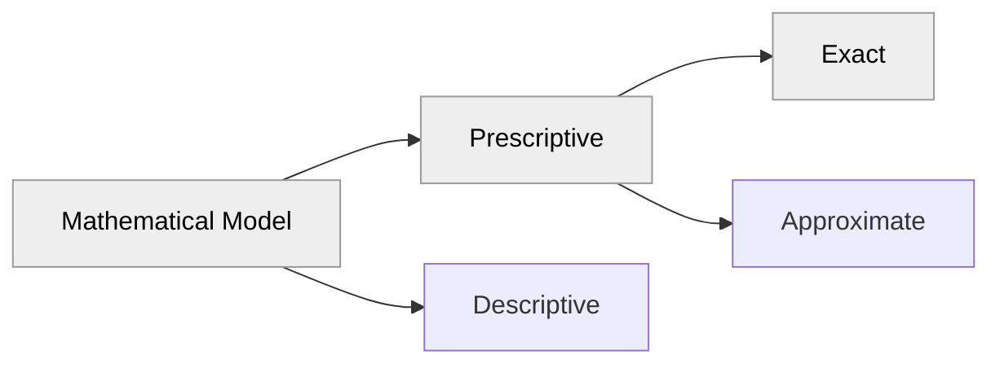

# Course Timetabling

## Phase 1: Allocate professors to courses

This project is a course timetabling system that uses a mathematical model to optimize the allocation of professors to courses. The optimization method is based on linear programming using the Gurobi solver. The case study is applied to the Institute of Computing at UFRJ, as part of my undergraduate thesis.

> The latest result of the model, pointing to the main branch, can be viewed at the following URL: [https://course-timetabling-ufrj.streamlit.app](https://course-timetabling-ufrj.streamlit.app)

### Phase 2: Allocate classrooms to courses
This project is part 1 of 2. The second phase, which will be released soon, will focus on the allocation of classrooms. This phase will use the results of the current model to continue the optimization process.

### Method



## Installation

### Prerequisites

- Python 3.9 or higher
- pip (Python package installer)
- pipenv (requirements)
- Virtual environment (recommended)

### Steps

1. **Clone the repository:**

    ```sh
    git clone https://github.com/gabriellydeandrade/course_timetabling.git
    ```

2. **Create a virtual environment inside the project (recommended):**

    ```sh
    cd course_timetabling
    python -m venv .venv
    ```

3. **Activate the virtual environment (recommended):**

    - On macOS/Linux:

        ```sh
        source .venv/bin/activate
        ```

    - On Windows:

        ```sh
        .venv\Scripts\activate
        ```

4. **Install the required packages:**

    ```sh
    pip install pipenv
    pipenv install
    ```

## Running the Code

### Running the Optimization Model

To run the optimization model and generate the timetabling results, execute the following command:

```sh
python course_timetabling/main.py
```

Two .csv files will be updated into `results` folder

## Viewing the Results

To view the results using Streamlit, run the following command:

```sh
streamlit run course_timetabling/results/generate_timetabling.py
```

This will start a local Streamlit server. Open your web browser and navigate to the URL provided in the terminal (usually http://localhost:8501).

## Project Structure

```
course_timetabling/
├── cache/
├── course_timetabling/
├── ├── database/
├── │   ├── construct_sets.py
├── │   ├── service_google_sheet.py
├── │   ├── transform_data.py
├── ├── results/
├── │   ├── generate_timetabling.py
├── │   ├── timeschedule.csv
├── │   ├── pcb_professors.csv
├── ├── tests/
├── ├── utils/
├── ├── main.py
├── ├── settings.py
├── Pipfile
├── Pipfile.lock
├── README.md
```

## Mathematical Formulation

See the [course_timetabling.ipynb](course_timetabling.ipynb) file